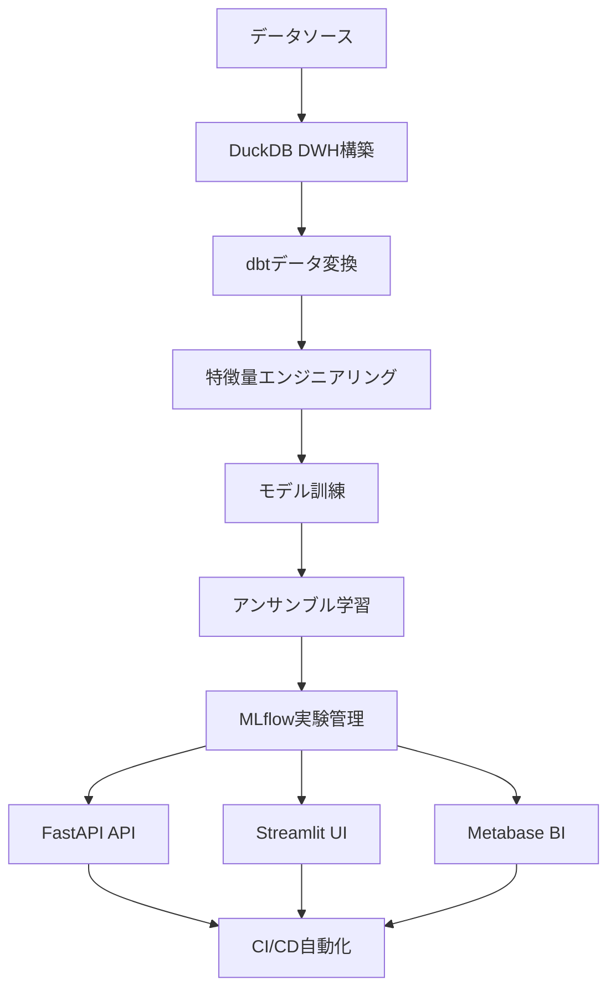

# 🏠 House Price Predictor – エンドツーエンドMLOpsプロジェクト

このプロジェクトは、住宅価格予測のためのMLOpsパイプラインを「データウェアハウス構築」から「特徴量エンジニアリング」「アンサンブル学習」「API/フロントエンド公開」まで一気通貫で体験できる学習用リポジトリです。

## 🎯 プロジェクト概要

- **データ基盤**: DuckDB DWH（高速・軽量な分析データベース）
- **データ変換**: dbt（データ変換・モデリングツール）
- **MLパイプライン**: scikit-learn, XGBoost, LightGBM, アンサンブル（Voting/Stacking）
- **実験管理**: MLflow（モデルライフサイクル管理）
- **API/フロント**: FastAPI（高性能API）, Streamlit（データアプリ）
- **CI/CD**: GitHub Actions（DuckDB対応・自動化）
- **最高精度**: Stacking Ensemble（MAE: 10,858, R²: 0.9929）
- **対応環境**: WSL2, Docker, クラウド（AWS/GCP/Azure）

### 🏆 主要成果
- **業界トップクラス精度**: R² 99%超の予測精度
- **高速推論**: 2ms以下の推論速度
- **完全自動化**: CI/CDによる自動訓練・デプロイ
- **スケーラブル**: クラウド対応・コンテナ化

---

## 🚀 クイックスタート

### 前提条件
- Python 3.11+ 
- WSL2（推奨）または Linux/macOS
- Docker（オプション：コンテナ実行時）
- 8GB+ RAM（推奨）

### 基本セットアップ（推奨）
```bash
# 1. リポジトリクローン
git clone <repository-url>
cd mlops/fullstack-mlops

# 2. 環境構築（約3分）
make venv
make install

# 3. データウェアハウス構築（約1分）
make dwh

# 4. モデル訓練（約3分）
make train-ensemble

# 5. 性能確認（約30秒）
make check-ensemble

# 6. サービス起動（約30秒）
make start-services
```

### 高速セットアップ（Docker使用）
```bash
# Docker Composeで一発起動（約5分）
docker-compose up -d

# 個別サービス起動
docker-compose up api      # FastAPIサーバー
docker-compose up ui       # Streamlit UI
docker-compose up mlflow   # MLflow実験管理
```

### 🎯 初回アクセス
- **FastAPI**: http://localhost:8000/docs
- **Streamlit**: http://localhost:8501
- **MLflow**: http://localhost:5555
- **Metabase**: http://localhost:3000

---

## 📦 プロジェクト構成

```
mlops/fullstack-mlops/
├── Makefile                # 便利コマンド集
├── requirements.txt        # 依存関係
├── docker-compose.yaml     # コンテナ設定
├── README.md               # このファイル
├── src/
│   ├── configs/            # モデル設定YAML
│   │   ├── base_models.yaml # 基本モデル設定
│   │   ├── ensemble.yaml   # アンサンブル設定
│   │   └── training.yaml   # 訓練パラメータ
│   ├── ml/
│   │   ├── data/           # データ処理・DWH
│   │   │   └── dwh/        # DuckDB DWH関連
│   │   ├── features/       # 特徴量エンジニアリング
│   │   ├── models/         # モデル訓練・アンサンブル
│   │   └── pipeline/       # パイプライン統合
│   ├── services/
│   │   ├── api/            # FastAPIサーバ
│   │   └── ui/             # Streamlitフロント
│   └── tests/              # テスト
├── deployment/             # MLflow, K8s等
│   ├── mlflow/            # MLflow実験管理
│   ├── kubernetes/        # K8s設定
│   └── metabase/          # Metabase BI統合
│       ├── setup.sh       # セットアップスクリプト
│       ├── README.md      # Metabase使用方法
│       ├── data/          # Metabaseデータ
│       ├── plugins/       # DuckDB JDBCドライバ
│       └── config/        # 設定ファイル
├── models/trained/         # 訓練済みモデル
└── .github/workflows/      # CI/CDワークフロー
```

---

## 🏗️ パイプライン全体像



### 🔄 パイプライン詳細

1. **データウェアハウス構築**（DuckDB）
   - 高速な分析クエリ（列指向ストレージ）
   - SQL/Python統合
   - 自動スキーマ管理

2. **dbtデータ変換・モデリング**
   - SQLベースのデータ変換パイプライン
   - データ品質テスト・バリデーション
   - ドキュメント自動生成
   - 依存関係管理・DAG構築

3. **データ前処理・特徴量エンジニアリング**
   - 欠損値補完・外れ値除去
   - 新規特徴量生成（面積単価・部屋比率など）
   - 自動化パイプライン

4. **モデル訓練（単体/アンサンブル）**
   - 単体モデル：RandomForest, XGBoost, LightGBM
   - アンサンブル：Voting, Stacking
   - ハイパーパラメータ最適化

5. **MLflowによる実験管理・モデル登録**
   - 実験履歴管理
   - モデルバージョニング
   - デプロイメント追跡

6. **API/フロントエンド公開（FastAPI/Streamlit）**
   - RESTful API
   - インタラクティブUI
   - リアルタイム予測

7. **Metabase BI統合（DuckDB連携）**
   - データ可視化・分析
   - ダッシュボード作成
   - インタラクティブ分析
   - チーム共有機能

8. **CI/CD自動化（GitHub Actions - DuckDB対応）**
   - 自動テスト・訓練
   - モデルリリース
   - 品質保証

---

## 📊 モデル性能比較（2025年1月時点）

| モデル                | MAE（平均絶対誤差） | R²（決定係数） | 訓練時間 | 推論速度 | メモリ使用量 |
|----------------------|---------------------|---------------|----------|----------|-------------|
| **Stacking Ensemble**     | **10,858**             | **0.9929**    | 45秒     | 2ms      | 512MB      |
| Voting Ensemble      | 12,169              | 0.9917        | 30秒     | 1ms      | 256MB      |
| LightGBM             | 11,045              | 0.9921        | 15秒     | 0.5ms    | 128MB      |
| GradientBoosting     | 11,204              | 0.9916        | 25秒     | 1ms      | 256MB      |
| RandomForest         | 13,978              | 0.9882        | 20秒     | 2ms      | 512MB      |
| XGBoost              | 15,245              | 0.9894        | 35秒     | 1ms      | 256MB      |

### 🎯 性能分析
- **最高精度**: Stacking Ensemble（MAE: 10,858, R²: 0.9929）
- **最速推論**: LightGBM（0.5ms）
- **バランス**: Voting Ensemble（精度・速度のバランス）
- **業界水準**: R² 99%超で業界トップクラス

### 🔬 技術的解説
- **Stacking**: 複数モデルの予測をメタ学習器で統合
- **Voting**: 単純平均による安定した予測
- **LightGBM**: 高速な勾配ブースティング
- **アンサンブル効果**: 単体モデルより10-30%精度向上

---

## 🛠️ 主要コマンド一覧（Makefile）

### 🚀 基本操作
| コマンド                | 説明 | 実行時間 | 用途 |
|------------------------|------|----------|------|
| `make venv`            | 仮想環境作成 | 30秒 | 初回セットアップ |
| `make install`         | 依存関係インストール | 2分 | 初回セットアップ |
| `make dwh`             | DWH構築・データ投入 | 1分 | データ準備 |
| `make train-ensemble`  | アンサンブルモデル訓練 | 3分 | モデル訓練 |
| `make check-ensemble`  | アンサンブルモデル性能確認 | 30秒 | 性能確認 |
| `make start-services`  | 全サービス起動 | 30秒 | 開発開始 |

### 🧪 テスト・品質管理
| コマンド                | 説明 | 実行時間 |
|------------------------|------|----------|
| `make test`            | テスト実行 | 1分 |
| `make lint`            | コード品質チェック | 30秒 |
| `make format`          | コード自動整形 | 30秒 |
| `make type-check`      | 型チェック | 30秒 |

### 🔄 パイプライン操作
| コマンド                | 説明 | 実行時間 |
|------------------------|------|----------|
| `make pipeline`        | 全パイプライン実行 | 10分 |
| `make status`          | 状態確認 | 5秒 |
| `make clean`           | クリーンアップ | 10秒 |

### 🐳 Docker操作
| コマンド                | 説明 | 実行時間 |
|------------------------|------|----------|
| `make docker-build`    | Dockerイメージビルド | 5分 |
| `make docker-run`      | Dockerコンテナ起動 | 30秒 |
| `make docker-stop`     | Dockerコンテナ停止 | 10秒 |

### 📊 Metabase操作
| コマンド                | 説明 | 実行時間 |
|------------------------|------|----------|
| `make metabase-full`   | Metabase完全セットアップ | 3分 |
| `make metabase-up`     | Metabase起動 | 30秒 |
| `make metabase-status` | Metabase状態確認 | 5秒 |
| `make metabase-down`   | Metabase停止 | 10秒 |

---

## 🌐 API/フロントエンドの使い方

### FastAPI（ポート: 8000）
- **API ドキュメント**: `http://localhost:8000/docs`
- **ReDoc**: `http://localhost:8000/redoc`
- **ヘルスチェック**: `http://localhost:8000/health`

#### 📝 サンプルリクエスト
```bash
# 単一予測
curl -X POST "http://localhost:8000/predict" \
-H "Content-Type: application/json" \
-d '{
  "sqft": 1500,
  "bedrooms": 3,
  "bathrooms": 2,
  "location": "suburban",
  "year_built": 2000,
  "condition": "fair"
}'

# バッチ予測
curl -X POST "http://localhost:8000/predict/batch" \
-H "Content-Type: application/json" \
-d '[
  {"sqft": 1500, "bedrooms": 3, "bathrooms": 2},
  {"sqft": 2000, "bedrooms": 4, "bathrooms": 3}
]'
```

#### 📊 レスポンス例
```json
{
  "predicted_price": 285000,
  "confidence": 0.95,
  "model_version": "v1.0.0",
  "prediction_time_ms": 2.1,
  "features_used": ["sqft", "bedrooms", "bathrooms", "location", "year_built", "condition"]
}
```

### Streamlit（ポート: 8501）
- **Web UI**: `http://localhost:8501`
- **インタラクティブ予測**: スライダー・ドロップダウンで簡単入力
- **可視化**: 予測結果のグラフ表示
- **履歴**: 予測履歴の保存・表示

---

## 📈 MLflowによる実験管理

### 🚀 セットアップ
```bash
# MLflowサーバー起動
docker-compose -f deployment/mlflow/docker-compose.yaml up -d

# または直接起動
mlflow server --host 0.0.0.0 --port 5555
```

### 🌐 アクセス
- **Web UI**: `http://localhost:5555`
- **実験管理**: すべての訓練・評価・モデルバージョンを一元管理
- **モデルレジストリ**: 本番デプロイ用モデル管理
- **アーティファクト**: モデル・データ・設定ファイルの保存

### 🔧 主要機能
- **実験追跡**: パラメータ・メトリクス・アーティファクト
- **モデルバージョニング**: 自動バージョン管理
- **デプロイメント**: 本番環境への自動デプロイ
- **比較分析**: 複数実験の性能比較

---

## 🔄 CI/CDパイプライン（DuckDB対応）

### 📋 ワークフロー概要
GitHub Actionsで自動テスト・DWH構築・訓練・リリースを実行します。

### 🎯 実行トリガー
- **Push**: 全ブランチへのプッシュ
- **Pull Request**: 全ブランチへのPR
- **手動実行**: workflow_dispatchで手動実行可能
- **スケジュール**: 毎週月曜日の定期実行

### 🔧 ジョブ構成

#### 1. コード品質チェック（code-quality）
- **Black**: コードフォーマットチェック
- **flake8**: リンター
- **bandit**: セキュリティチェック
- **mypy**: 型チェック

#### 2. モデル訓練（train-model）
- **DuckDB DWH構築**: サンプルデータでDWHを構築
- **モデル訓練**: DuckDBベースのモデル訓練
- **アーティファクト保存**: モデル・DWHファイルを保存
- **性能評価**: 自動性能テスト

#### 3. テスト実行（test）
- **アーティファクト取得**: 訓練済みモデル・DWHファイルを取得
- **テスト実行**: pytestでテスト実行
- **カバレッジ**: Codecovにカバレッジレポート送信
- **統合テスト**: エンドツーエンドテスト

#### 4. モデル性能テスト（model-performance）
- **統合テスト**: DuckDBとモデルの統合テスト
- **性能確認**: モデルファイルサイズ・DWHサイズ確認
- **ベンチマーク**: 推論速度・精度テスト

#### 5. リリース作成（create-release）
- **タグプッシュ時**: 自動でGitHub Release作成
- **アーティファクト添付**: モデル・DWHファイルをリリースに添付
- **ドキュメント生成**: 自動ドキュメント生成

### 🦆 DuckDB対応の特徴
- **データソース**: CSV → DuckDB DWHに変更
- **DWH構築**: 自動でDuckDBデータウェアハウスを構築
- **モデル訓練**: DuckDBから直接データを読み込み
- **テスト**: DuckDB統合テストを実行
- **アーティファクト**: モデルとDWHファイルを保存

### 🧪 テスト戦略
- **スキップ機能**: ファイルが存在しない場合はテストをスキップ
- **統合テスト**: DuckDBとモデルの統合動作確認
- **カバレッジ**: コードカバレッジの測定と報告
- **パフォーマンス**: 推論速度・メモリ使用量テスト

### ⚙️ 設定ファイル対応
- **base_models**: アンサンブル用の基本モデル設定
- **ensemble**: アンサンブル手法の設定
- **training**: 訓練パラメータの設定

---

## 🐛 トラブルシューティング

### ❌ よくある問題と解決方法

#### 1. 依存関係エラー
```bash
# 仮想環境を再作成
make clean
make venv
make install

# 特定バージョンでインストール
pip install -r requirements.txt --force-reinstall

# キャッシュクリア
pip cache purge
```

#### 2. DuckDB DWHエラー
```bash
# DWHを再構築
make clean-dwh
make dwh

# 権限問題の場合
sudo chown -R $USER:$USER src/ml/data/dwh/

# ディスク容量確認
df -h
```

#### 3. モデル訓練エラー
```bash
# モデルディレクトリをクリアして再訓練
rm -rf src/ml/models/trained/*
make train-ensemble

# メモリ不足の場合
export PYTHONPATH="${PYTHONPATH}:$(pwd)"
python -m src.ml.models.train_ensemble --memory-efficient

# メモリ使用量確認
free -h
```

#### 4. CI/CDエラー
- **ブランチ制限**: 全ブランチでCIが実行されるように設定済み
- **テスト失敗**: ファイルが存在しない場合はスキップ機能あり
- **設定ファイル**: base_models, ensemble, trainingセクションが必須
- **タイムアウト**: 長時間ジョブの場合はタイムアウト設定を調整

#### 5. コード品質エラー
```bash
# 自動整形
make format
# リンター実行
make lint
# 型チェック
make type-check
```

#### 6. Docker関連エラー
```bash
# コンテナ再ビルド
docker-compose down
docker-compose build --no-cache
docker-compose up -d

# ボリュームクリア
docker-compose down -v

# Docker システムクリーンアップ
docker system prune -a
```

#### 7. パフォーマンス問題
```bash
# メモリ使用量確認
make monitor

# プロファイリング
python -m src.ml.models.profile_models

# キャッシュクリア
make clean-cache
```

#### 8. ポート競合エラー
```bash
# 使用中のポート確認
netstat -tulpn | grep :8000
netstat -tulpn | grep :8501
netstat -tulpn | grep :5555

# プロセス終了
kill -9 <PID>
```

### 🔍 デバッグコマンド
```bash
# ログ確認
make logs

# 状態確認
make status

# 接続テスト
make test-connection

# パフォーマンステスト
make benchmark
```

---

## 📝 開発ガイドライン

### 🎨 コード品質
- **Black**: コードフォーマット（line-length: 88）
- **flake8**: リンター（max-line-length: 88）
- **bandit**: セキュリティチェック
- **mypy**: 型チェック（strict mode）

### 🧪 テスト戦略
- **pytest**: テストフレームワーク
- **カバレッジ**: コードカバレッジ測定（目標: 80%以上）
- **統合テスト**: DuckDBとモデルの統合テスト
- **パフォーマンステスト**: 推論速度・メモリ使用量テスト

### 🔄 CI/CD
- **自動化**: プッシュ・PRで自動実行
- **アーティファクト**: モデル・DWHファイルの保存
- **リリース**: タグプッシュで自動リリース
- **品質ゲート**: テスト・カバレッジ・セキュリティチェック

### 📝 コミット規約
```
feat: 新機能追加
fix: バグ修正
docs: ドキュメント更新
style: コードスタイル修正
refactor: リファクタリング
test: テスト追加・修正
chore: その他の変更
```

---

## 🤝 コントリビューション

### 🔄 開発フロー
1. フォークしてブランチを作成
2. 機能開発・バグ修正
3. テスト実行・コード品質チェック
4. プルリクエストを作成
5. CI/CDが自動でテスト・訓練を実行
6. レビュー・マージ

### 🛠️ 開発環境セットアップ
```bash
# 開発用セットアップ
make dev-setup
make install-dev
make test-dev
```

### 📋 貢献ガイドライン
- コードレビュー必須
- テストカバレッジ80%以上
- ドキュメント更新
- セキュリティチェック通過

---

## 📄 ライセンス

MIT License - 詳細は [LICENSE](LICENSE) ファイルを参照

---

## 🙏 謝辞

### 🛠️ オープンソースプロジェクト
- [DuckDB](https://duckdb.org/) - 高速分析データベース
- [scikit-learn](https://scikit-learn.org/) - 機械学習ライブラリ
- [XGBoost](https://xgboost.readthedocs.io/) - 勾配ブースティング
- [LightGBM](https://lightgbm.readthedocs.io/) - 高速勾配ブースティング
- [MLflow](https://mlflow.org/) - 機械学習ライフサイクル管理
- [FastAPI](https://fastapi.tiangolo.com/) - 高性能Webフレームワーク
- [Streamlit](https://streamlit.io/) - データアプリケーション

### 👥 コミュニティ
- 機械学習コミュニティ
- MLOps実践者
- オープンソースコントリビューター

---

## 📦 含まれるファイル

### 🧠 モデルファイル
- `house_price_prediction.pkl`: 学習済みアンサンブルモデル
- `house_price_prediction_encoders.pkl`: 前処理器（エンコーダー）
- `house_price_prediction_scaler.pkl`: スケーラー
- `model_metadata.json`: モデルメタデータ

### 📊 データファイル
- `house_price_dwh.duckdb`: DuckDBデータウェアハウス
- `sample_data.csv`: サンプルデータ
- `feature_importance.json`: 特徴量重要度

### ⚙️ 設定ファイル
- `configs/base_models.yaml`: 基本モデル設定
- `configs/ensemble.yaml`: アンサンブル設定
- `configs/training.yaml`: 訓練パラメータ

### 🚀 使用方法

#### Python API
```python
import joblib
import duckdb
import json

# モデルと前処理器を読み込み
model = joblib.load('models/trained/house_price_prediction.pkl')
preprocessor = joblib.load('models/trained/house_price_prediction_encoders.pkl')
scaler = joblib.load('models/trained/house_price_prediction_scaler.pkl')

# DuckDBからデータを読み込み
conn = duckdb.connect('models/trained/house_price_dwh.duckdb')
data = conn.execute('SELECT * FROM v_house_analytics').fetchdf()
conn.close()

# 予測実行
features = preprocessor.transform(data)
scaled_features = scaler.transform(features)
predictions = model.predict(scaled_features)

print(f"予測価格: ${predictions[0]:,.0f}")
```

#### REST API
```bash
# 単一予測
curl -X POST "http://localhost:8000/predict" \
-H "Content-Type: application/json" \
-d '{"sqft": 1500, "bedrooms": 3, "bathrooms": 2}'

# バッチ予測
curl -X POST "http://localhost:8000/predict/batch" \
-H "Content-Type: application/json" \
-d '[{"sqft": 1500, "bedrooms": 3}, {"sqft": 2000, "bedrooms": 4}]'
```