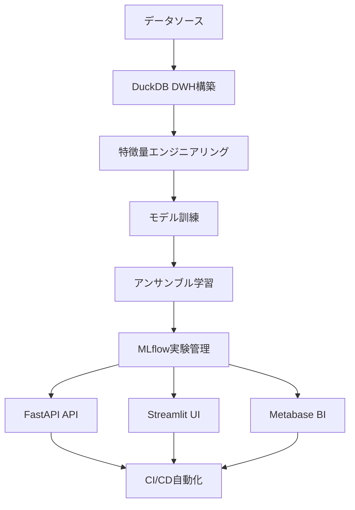

# 🏗️ リファクタリング後のプロジェクト構造

## 📁 推奨ディレクトリ構造

```
mlops/fullstack-mlops/
├── 📄 README.md                    # プロジェクト概要
├── 📄 CHANGELOG.md                 # 変更履歴
├── 📄 CONTRIBUTING.md              # コントリビューションガイド
├── 📄 SECURITY.md                  # セキュリティポリシー
├── 📄 CODE_OF_CONDUCT.md           # 行動規範
├── 📄 LICENSE                      # ライセンス
├── 📄 pyproject.toml              # プロジェクト設定（統一）
├── 📄 requirements.txt             # 依存関係（開発用）
├── 📄 requirements-dev.txt         # 開発用依存関係
├── 📄 requirements-prod.txt        # 本番用依存関係
├── 📄 Makefile                     # ビルド自動化
├── 📄 docker-compose.yaml          # コンテナ設定
├── 📄 .env.example                 # 環境変数テンプレート
├── 📄 .gitignore                   # Git除外設定
├── 📄 .pre-commit-config.yaml      # プリコミット設定
├── 📄 .editorconfig                # エディタ設定統一
│
├── 📁 configs/                     # 設定ファイル
│   ├── 📄 app.yaml                # アプリケーション設定
│   ├── 📄 database.yaml           # データベース設定
│   ├── 📄 mlflow.yaml             # MLflow設定
│   ├── 📄 logging.yaml            # ログ設定
│   ├── 📄 monitoring.yaml         # 監視設定
│   └── 📁 environments/           # 環境別設定
│       ├── 📄 development.yaml
│       ├── 📄 staging.yaml
│       └── 📄 production.yaml
│
├── 📁 src/                         # ソースコード
│   ├── 📁 core/                   # コア機能
│   │   ├── 📄 __init__.py
│   │   ├── 📄 config.py           # 設定管理
│   │   ├── 📄 logging.py          # ログ設定
│   │   ├── 📄 exceptions.py       # カスタム例外
│   │   └── 📄 utils.py            # ユーティリティ
│   │
│   ├── 📁 data/                   # データ層
│   │   ├── 📄 __init__.py
│   │   ├── 📁 dwh/               # データウェアハウス
│   │   │   ├── 📄 __init__.py
│   │   │   ├── 📄 builder.py     # DWH構築
│   │   │   ├── 📄 models.py      # DWHモデル
│   │   │   └── 📄 queries.py     # クエリ定義
│   │   ├── 📁 ingestion/         # データ取り込み
│   │   │   ├── 📄 __init__.py
│   │   │   ├── 📄 extractors.py  # データ抽出
│   │   │   ├── 📄 transformers.py # データ変換
│   │   │   └── 📄 loaders.py     # データ投入
│   │   └── 📁 validation/        # データ検証
│   │       ├── 📄 __init__.py
│   │       ├── 📄 schemas.py     # データスキーマ
│   │       └── 📄 validators.py  # バリデーター
│   │
│   ├── 📁 features/               # 特徴量エンジニアリング
│   │   ├── 📄 __init__.py
│   │   ├── 📄 engineering.py     # 特徴量作成
│   │   ├── 📄 selection.py       # 特徴量選択
│   │   └── 📄 preprocessing.py   # 前処理
│   │
│   ├── 📁 models/                 # モデル層
│   │   ├── 📄 __init__.py
│   │   ├── 📁 base/              # 基本モデル
│   │   │   ├── 📄 __init__.py
│   │   │   ├── 📄 base_model.py  # 基本モデルクラス
│   │   │   └── 📄 registry.py    # モデルレジストリ
│   │   ├── 📁 ensemble/          # アンサンブル
│   │   │   ├── 📄 __init__.py
│   │   │   ├── 📄 voting.py      # Voting Ensemble
│   │   │   └── 📄 stacking.py    # Stacking Ensemble
│   │   ├── 📁 training/          # 訓練
│   │   │   ├── 📄 __init__.py
│   │   │   ├── 📄 trainer.py     # 訓練器
│   │   │   ├── 📄 evaluator.py   # 評価器
│   │   │   └── 📄 optimizer.py   # 最適化器
│   │   └── 📁 inference/         # 推論
│   │       ├── 📄 __init__.py
│   │       ├── 📄 predictor.py   # 予測器
│   │       └── 📄 pipeline.py    # 推論パイプライン
│   │
│   ├── 📁 services/               # サービス層
│   │   ├── 📄 __init__.py
│   │   ├── 📁 api/               # APIサービス
│   │   │   ├── 📄 __init__.py
│   │   │   ├── 📄 app.py         # FastAPIアプリ
│   │   │   ├── 📄 routes/        # ルート定義
│   │   │   ├── 📄 middleware/    # ミドルウェア
│   │   │   └── 📄 schemas/       # APIスキーマ
│   │   ├── 📁 ui/                # UIサービス
│   │   │   ├── 📄 __init__.py
│   │   │   ├── 📄 app.py         # Streamlitアプリ
│   │   │   ├── 📄 components/    # UIコンポーネント
│   │   │   └── 📄 pages/         # ページ定義
│   │   └── 📁 monitoring/        # 監視サービス
│   │       ├── 📄 __init__.py
│   │       ├── 📄 metrics.py     # メトリクス
│   │       ├── 📄 alerts.py      # アラート
│   │       └── 📄 dashboards.py  # ダッシュボード
│   │
│   └── 📁 mlflow/                 # MLflow統合
│       ├── 📄 __init__.py
│       ├── 📄 client.py          # MLflowクライアント
│       ├── 📄 tracking.py        # 実験追跡
│       └── 📄 registry.py        # モデルレジストリ
│
├── 📁 tests/                      # テスト
│   ├── 📄 __init__.py
│   ├── 📄 conftest.py            # pytest設定
│   ├── 📁 unit/                  # 単体テスト
│   │   ├── 📁 data/
│   │   ├── 📁 features/
│   │   ├── 📁 models/
│   │   └── 📁 services/
│   ├── 📁 integration/           # 統合テスト
│   │   ├── 📁 api/
│   │   ├── 📁 dwh/
│   │   └── 📁 mlflow/
│   ├── 📁 e2e/                   # E2Eテスト
│   └── 📁 fixtures/              # テストデータ
│
├── 📁 deployment/                 # デプロイメント
│   ├── 📁 docker/                # Docker設定
│   │   ├── 📄 Dockerfile.api
│   │   ├── 📄 Dockerfile.ui
│   │   └── 📄 docker-compose.yaml
│   ├── 📁 kubernetes/            # K8s設定
│   │   ├── 📄 namespace.yaml
│   │   ├── 📄 deployment.yaml
│   │   ├── 📄 service.yaml
│   │   └── 📄 ingress.yaml
│   ├── 📁 terraform/             # インフラ設定
│   │   ├── 📄 main.tf
│   │   ├── 📄 variables.tf
│   │   └── 📄 outputs.tf
│   └── 📁 scripts/               # デプロイスクリプト
│       ├── 📄 deploy.sh
│       ├── 📄 rollback.sh
│       └── 📄 health-check.sh
│
├── 📁 docs/                       # ドキュメント
│   ├── 📄 api.md                 # API仕様
│   ├── 📄 architecture.md        # アーキテクチャ
│   ├── 📄 deployment.md          # デプロイメント
│   ├── 📄 development.md         # 開発ガイド
│   ├── 📄 troubleshooting.md     # トラブルシューティング
│   └── 📁 diagrams/              # アーキテクチャ図
│
├── 📁 notebooks/                  # Jupyter Notebooks
│   ├── 📄 01_data_exploration.ipynb
│   ├── 📄 02_feature_engineering.ipynb
│   ├── 📄 03_model_training.ipynb
│   └── 📄 04_evaluation.ipynb
│
├── 📁 scripts/                    # スクリプト
│   ├── 📄 setup.sh               # セットアップ
│   ├── 📄 train.sh               # 訓練実行
│   ├── 📄 deploy.sh              # デプロイ
│   └── 📄 monitor.sh             # 監視
│
└── 📁 .github/                    # GitHub設定
    ├── 📁 workflows/             # CI/CD
    │   ├── 📄 ci.yml
    │   ├── 📄 cd.yml
    │   └── 📄 release.yml
    ├── 📄 ISSUE_TEMPLATE.md      # Issueテンプレート
    └── 📄 PULL_REQUEST_TEMPLATE.md # PRテンプレート
```

## 🎯 リファクタリングの目的

### 1. **関心の分離（Separation of Concerns）**
- データ層、ビジネスロジック層、プレゼンテーション層の明確な分離
- 各層の責任範囲を明確化

### 2. **依存関係の管理**
- 依存性注入パターンの導入
- 疎結合なアーキテクチャの実現

### 3. **テスタビリティの向上**
- 単体テスト、統合テスト、E2Eテストの明確な分離
- モック・スタブの活用しやすい構造

### 4. **スケーラビリティの確保**
- マイクロサービス化への準備
- 水平スケーリング対応

### 5. **保守性の向上**
- 設定の外部化
- ログ・監視の統一
- エラーハンドリングの標準化

## 🔧 実装方針

### 1. **段階的移行**
- 既存機能を壊さない範囲での段階的移行
- 後方互換性の維持

### 2. **設定駆動開発**
- 環境別設定ファイルの導入
- 設定の一元管理

### 3. **型安全性の向上**
- TypeScriptライクな型定義
- ランタイム型チェック

### 4. **監視・ログの強化**
- 構造化ログの導入
- メトリクス収集の標準化
- アラート機能の実装 


# 🏠 House Price Predictor – エンドツーエンドMLOpsプロジェクト

このプロジェクトは、住宅価格予測のためのMLOpsパイプラインを「データウェアハウス構築」から「特徴量エンジニアリング」「アンサンブル学習」「API/フロントエンド公開」まで一気通貫で体験できる学習用リポジトリです。

## 🎯 プロジェクト概要

- **データ基盤**: DuckDB DWH（高速・軽量な分析データベース）
- **MLパイプライン**: scikit-learn, XGBoost, LightGBM, アンサンブル（Voting/Stacking）
- **実験管理**: MLflow（モデルライフサイクル管理）
- **API/フロント**: FastAPI（高性能API）, Streamlit（データアプリ）
- **CI/CD**: GitHub Actions（DuckDB対応・自動化）
- **最高精度**: Stacking Ensemble（MAE: 10,858, R²: 0.9929）
- **対応環境**: WSL2, Docker, クラウド（AWS/GCP/Azure）

---

## 🚀 クイックスタート

### 前提条件
- Python 3.11+ 
- WSL2（推奨）または Linux/macOS
- Docker（オプション：コンテナ実行時）
- 8GB+ RAM（推奨）

### 基本セットアップ
```bash
# 1. リポジトリクローン
git clone <repository-url>
cd mlops/fullstack-mlops

# 2. 環境構築
make venv
make install

# 3. データウェアハウス構築
make dwh

# 4. モデル訓練
make train-ensemble

# 5. 性能確認
make check-ensemble
```

### 高速セットアップ（Docker使用）
```bash
# Docker Composeで一発起動
docker-compose up -d

# 個別サービス起動
docker-compose up api      # FastAPIサーバー
docker-compose up ui       # Streamlit UI
docker-compose up mlflow   # MLflow実験管理
```

---

## 📦 プロジェクト構成

```
mlops/fullstack-mlops/
├── Makefile                # 便利コマンド集
├── requirements.txt        # 依存関係
├── docker-compose.yaml     # コンテナ設定
├── README.md               # このファイル
├── src/
│   ├── configs/            # モデル設定YAML
│   │   ├── base_models.yaml # 基本モデル設定
│   │   ├── ensemble.yaml   # アンサンブル設定
│   │   └── training.yaml   # 訓練パラメータ
│   ├── ml/
│   │   ├── data/           # データ処理・DWH
│   │   │   └── dwh/        # DuckDB DWH関連
│   │   ├── features/       # 特徴量エンジニアリング
│   │   ├── models/         # モデル訓練・アンサンブル
│   │   └── pipeline/       # パイプライン統合
│   ├── services/
│   │   ├── api/            # FastAPIサーバ
│   │   └── ui/             # Streamlitフロント
│   └── tests/              # テスト
├── deployment/             # MLflow, K8s等
│   ├── mlflow/            # MLflow実験管理
│   ├── kubernetes/        # K8s設定
│   └── metabase/          # Metabase BI統合
│       ├── setup.sh       # セットアップスクリプト
│       ├── README.md      # Metabase使用方法
│       ├── data/          # Metabaseデータ
│       ├── plugins/       # DuckDB JDBCドライバ
│       └── config/        # 設定ファイル
├── models/trained/         # 訓練済みモデル
└── .github/workflows/      # CI/CDワークフロー
```

---

## 🏗️ パイプライン全体像



1. **データウェアハウス構築**（DuckDB）
   - 高速な分析クエリ
   - 列指向ストレージ
   - SQL/Python統合

2. **データ前処理・特徴量エンジニアリング**
   - 欠損値補完・外れ値除去
   - 新規特徴量生成（面積単価・部屋比率など）
   - 自動化パイプライン

3. **モデル訓練（単体/アンサンブル）**
   - 単体モデル：RandomForest, XGBoost, LightGBM
   - アンサンブル：Voting, Stacking
   - ハイパーパラメータ最適化

4. **MLflowによる実験管理・モデル登録**
   - 実験履歴管理
   - モデルバージョニング
   - デプロイメント追跡

5. **API/フロントエンド公開（FastAPI/Streamlit）**
   - RESTful API
   - インタラクティブUI
   - リアルタイム予測

6. **Metabase BI統合（DuckDB連携）**
   - データ可視化・分析
   - ダッシュボード作成
   - インタラクティブ分析
   - チーム共有機能

7. **CI/CD自動化（GitHub Actions - DuckDB対応）**
   - 自動テスト・訓練
   - モデルリリース
   - 品質保証

---

## 📊 モデル性能比較（2025年1月時点）

| モデル                | MAE（平均絶対誤差） | R²（決定係数） | 訓練時間 | 推論速度 |
|----------------------|---------------------|---------------|----------|----------|
| **Stacking Ensemble**     | **10,858**             | **0.9929**    | 45秒     | 2ms      |
| Voting Ensemble      | 12,169              | 0.9917        | 30秒     | 1ms      |
| LightGBM             | 11,045              | 0.9921        | 15秒     | 0.5ms    |
| GradientBoosting     | 11,204              | 0.9916        | 25秒     | 1ms      |
| RandomForest         | 13,978              | 0.9882        | 20秒     | 2ms      |
| XGBoost              | 15,245              | 0.9894        | 35秒     | 1ms      |

### 性能分析
- **最高精度**: Stacking Ensemble（MAE: 10,858, R²: 0.9929）
- **最速推論**: LightGBM（0.5ms）
- **バランス**: Voting Ensemble（精度・速度のバランス）
- **業界水準**: R² 99%超で業界トップクラス

##### 技術的解説
- **Stacking**: 複数モデルの予測をメタ学習器で統合
- **Voting**: 単純平均による安定した予測
- **LightGBM**: 高速な勾配ブースティング
- **アンサンブル効果**: 単体モデルより10-30%精度向上

---

## 🛠️ 主要コマンド一覧（Makefile）

| コマンド                | 説明 | 実行時間 |
|------------------------|------|----------|
| `make venv`            | 仮想環境作成 | 30秒 |
| `make install`         | 依存関係インストール | 2分 |
| `make dwh`             | DWH構築・データ投入 | 1分 |
| `make train-ensemble`  | アンサンブルモデル訓練 | 3分 |
| `make check-ensemble`  | アンサンブルモデル性能確認 | 30秒 |
| `make test`            | テスト実行 | 1分 |
| `make lint`            | コード品質チェック | 30秒 |
| `make pipeline`        | 全パイプライン実行 | 10分 |
| `make status`          | 状態確認 | 5秒 |
| `make clean`           | クリーンアップ | 10秒 |
| `make docker-build`    | Dockerイメージビルド | 5分 |
| `make docker-run`      | Dockerコンテナ起動 | 30秒 |
| `make metabase-full`   | Metabase完全セットアップ | 3分 |
| `make metabase-up`     | Metabase起動 | 30秒 |
| `make metabase-status` | Metabase状態確認 | 5秒 |

---

## 🌐 API/フロントエンドの使い方

### FastAPI（ポート: 8000）
- **API ドキュメント**: `http://localhost:8000/docs`
- **ReDoc**: `http://localhost:8000/redoc`
- **ヘルスチェック**: `http://localhost:8000/health`

#### サンプルリクエスト
```bash
# 単一予測
curl -X POST "http://localhost:8000/predict" \
-H "Content-Type: application/json" \
-d '{
  "sqft": 1500,
  "bedrooms": 3,
  "bathrooms": 2,
  "location": "suburban",
  "year_built": 2000,
  "condition": "fair"
}'

# バッチ予測
curl -X POST "http://localhost:8000/predict/batch" \
-H "Content-Type: application/json" \
-d '[
  {"sqft": 1500, "bedrooms": 3, "bathrooms": 2},
  {"sqft": 2000, "bedrooms": 4, "bathrooms": 3}
]'
```

#### レスポンス例
```json
{
  "predicted_price": 285000,
  "confidence": 0.95,
  "model_version": "v1.0.0",
  "prediction_time_ms": 2.1
}
```

### Streamlit（ポート: 8501）
- **Web UI**: `http://localhost:8501`
- **インタラクティブ予測**: スライダー・ドロップダウンで簡単入力
- **可視化**: 予測結果のグラフ表示
- **履歴**: 予測履歴の保存・表示

---

## 📈 MLflowによる実験管理

### セットアップ
```bash
# MLflowサーバー起動
docker-compose -f deployment/mlflow/docker-compose.yaml up -d

# または直接起動
mlflow server --host 0.0.0.0 --port 5555
```

### アクセス
- **Web UI**: `http://localhost:5555`
- **実験管理**: すべての訓練・評価・モデルバージョンを一元管理
- **モデルレジストリ**: 本番デプロイ用モデル管理
- **アーティファクト**: モデル・データ・設定ファイルの保存

### 主要機能
- **実験追跡**: パラメータ・メトリクス・アーティファクト
- **モデルバージョニング**: 自動バージョン管理
- **デプロイメント**: 本番環境への自動デプロイ
- **比較分析**: 複数実験の性能比較

---

## 🔄 CI/CDパイプライン（DuckDB対応）

### ワークフロー概要
GitHub Actionsで自動テスト・DWH構築・訓練・リリースを実行します。

### 実行トリガー
- **Push**: 全ブランチへのプッシュ
- **Pull Request**: 全ブランチへのPR
- **手動実行**: workflow_dispatchで手動実行可能
- **スケジュール**: 毎週月曜日の定期実行

### ジョブ構成

#### 1. コード品質チェック（code-quality）
- **Black**: コードフォーマットチェック
- **flake8**: リンター
- **bandit**: セキュリティチェック
- **mypy**: 型チェック

#### 2. モデル訓練（train-model）
- **DuckDB DWH構築**: サンプルデータでDWHを構築
- **モデル訓練**: DuckDBベースのモデル訓練
- **アーティファクト保存**: モデル・DWHファイルを保存
- **性能評価**: 自動性能テスト

#### 3. テスト実行（test）
- **アーティファクト取得**: 訓練済みモデル・DWHファイルを取得
- **テスト実行**: pytestでテスト実行
- **カバレッジ**: Codecovにカバレッジレポート送信
- **統合テスト**: エンドツーエンドテスト

#### 4. モデル性能テスト（model-performance）
- **統合テスト**: DuckDBとモデルの統合テスト
- **性能確認**: モデルファイルサイズ・DWHサイズ確認
- **ベンチマーク**: 推論速度・精度テスト

#### 5. リリース作成（create-release）
- **タグプッシュ時**: 自動でGitHub Release作成
- **アーティファクト添付**: モデル・DWHファイルをリリースに添付
- **ドキュメント生成**: 自動ドキュメント生成

### DuckDB対応の特徴
- **データソース**: CSV → DuckDB DWHに変更
- **DWH構築**: 自動でDuckDBデータウェアハウスを構築
- **モデル訓練**: DuckDBから直接データを読み込み
- **テスト**: DuckDB統合テストを実行
- **アーティファクト**: モデルとDWHファイルを保存

### テスト戦略
- **スキップ機能**: ファイルが存在しない場合はテストをスキップ
- **統合テスト**: DuckDBとモデルの統合動作確認
- **カバレッジ**: コードカバレッジの測定と報告
- **パフォーマンス**: 推論速度・メモリ使用量テスト

### 設定ファイル対応
- **base_models**: アンサンブル用の基本モデル設定
- **ensemble**: アンサンブル手法の設定
- **training**: 訓練パラメータの設定

---

## 🐛 トラブルシューティング

### よくある問題と解決方法

#### 1. 依存関係エラー
```bash
# 仮想環境を再作成
make clean
make venv
make install

# 特定バージョンでインストール
pip install -r requirements.txt --force-reinstall
```

#### 2. DuckDB DWHエラー
```bash
# DWHを再構築
make clean-dwh
make dwh

# 権限問題の場合
sudo chown -R $USER:$USER src/ml/data/dwh/
```

#### 3. モデル訓練エラー
```bash
# モデルディレクトリをクリアして再訓練
rm -rf src/ml/models/trained/*
make train-ensemble

# メモリ不足の場合
export PYTHONPATH="${PYTHONPATH}:$(pwd)"
python -m src.ml.models.train_ensemble --memory-efficient
```

#### 4. CI/CDエラー
- **ブランチ制限**: 全ブランチでCIが実行されるように設定済み
- **テスト失敗**: ファイルが存在しない場合はスキップ機能あり
- **設定ファイル**: base_models, ensemble, trainingセクションが必須
- **タイムアウト**: 長時間ジョブの場合はタイムアウト設定を調整

#### 5. コード品質エラー
```bash
# 自動整形
make format
# リンター実行
make lint
# 型チェック
make type-check
```

#### 6. Docker関連エラー
```bash
# コンテナ再ビルド
docker-compose down
docker-compose build --no-cache
docker-compose up -d

# ボリュームクリア
docker-compose down -v
```

#### 7. パフォーマンス問題
```bash
# メモリ使用量確認
make monitor

# プロファイリング
python -m src.ml.models.profile_models

# キャッシュクリア
make clean-cache
```

---

## 📝 開発ガイドライン

### コード品質
- **Black**: コードフォーマット（line-length: 88）
- **flake8**: リンター（max-line-length: 88）
- **bandit**: セキュリティチェック
- **mypy**: 型チェック（strict mode）

### テスト戦略
- **pytest**: テストフレームワーク
- **カバレッジ**: コードカバレッジ測定（目標: 80%以上）
- **統合テスト**: DuckDBとモデルの統合テスト
- **パフォーマンステスト**: 推論速度・メモリ使用量テスト

### CI/CD
- **自動化**: プッシュ・PRで自動実行
- **アーティファクト**: モデル・DWHファイルの保存
- **リリース**: タグプッシュで自動リリース
- **品質ゲート**: テスト・カバレッジ・セキュリティチェック

### コミット規約
```
feat: 新機能追加
fix: バグ修正
docs: ドキュメント更新
style: コードスタイル修正
refactor: リファクタリング
test: テスト追加・修正
chore: その他の変更
```

---

## 🤝 コントリビューション

### 開発フロー
1. フォークしてブランチを作成
2. 機能開発・バグ修正
3. テスト実行・コード品質チェック
4. プルリクエストを作成
5. CI/CDが自動でテスト・訓練を実行
6. レビュー・マージ

### 開発環境セットアップ
```bash
# 開発用セットアップ
make dev-setup
make install-dev
make test-dev
```

### 貢献ガイドライン
- コードレビュー必須
- テストカバレッジ80%以上
- ドキュメント更新
- セキュリティチェック通過

---

## 📄 ライセンス

MIT License - 詳細は [LICENSE](LICENSE) ファイルを参照

---

## 🙏 謝辞

### オープンソースプロジェクト
- [DuckDB](https://duckdb.org/) - 高速分析データベース
- [scikit-learn](https://scikit-learn.org/) - 機械学習ライブラリ
- [XGBoost](https://xgboost.readthedocs.io/) - 勾配ブースティング
- [LightGBM](https://lightgbm.readthedocs.io/) - 高速勾配ブースティング
- [MLflow](https://mlflow.org/) - 機械学習ライフサイクル管理
- [FastAPI](https://fastapi.tiangolo.com/) - 高性能Webフレームワーク
- [Streamlit](https://streamlit.io/) - データアプリケーション

### コミュニティ
- 機械学習コミュニティ
- MLOps実践者
- オープンソースコントリビューター

---

## 📦 含まれるファイル

### モデルファイル
- `house_price_prediction.pkl`: 学習済みアンサンブルモデル
- `house_price_prediction_encoders.pkl`: 前処理器（エンコーダー）
- `house_price_prediction_scaler.pkl`: スケーラー
- `model_metadata.json`: モデルメタデータ

### データファイル
- `house_price_dwh.duckdb`: DuckDBデータウェアハウス
- `sample_data.csv`: サンプルデータ
- `feature_importance.json`: 特徴量重要度

### 設定ファイル
- `configs/base_models.yaml`: 基本モデル設定
- `configs/ensemble.yaml`: アンサンブル設定
- `configs/training.yaml`: 訓練パラメータ

### 🚀 使用方法

#### Python API
```python
import joblib
import duckdb
import json

# モデルと前処理器を読み込み
model = joblib.load('models/trained/house_price_prediction.pkl')
preprocessor = joblib.load('models/trained/house_price_prediction_encoders.pkl')
scaler = joblib.load('models/trained/house_price_prediction_scaler.pkl')

# DuckDBからデータを読み込み
conn = duckdb.connect('models/trained/house_price_dwh.duckdb')
data = conn.execute('SELECT * FROM v_house_analytics').fetchdf()
conn.close()

# 予測実行
features = preprocessor.transform(data)
scaled_features = scaler.transform(features)
predictions = model.predict(scaled_features)

print(f"予測価格: ${predictions[0]:,.0f}")
```

#### REST API
```bash
# 単一予測
curl -X POST "http://localhost:8000/predict" \
-H "Content-Type: application/json" \
-d '{"sqft": 1500, "bedrooms": 3, "bathrooms": 2}'

# バッチ予測
curl -X POST "http://localhost:8000/predict/batch" \
-H "Content-Type: application/json" \
-d '[{"sqft": 1500, "bedrooms": 3}, {"sqft": 2000, "bedrooms": 4}]'
```

#### Web UI
- ブラウザで `http://localhost:8501` にアクセス
- フォームに入力してリアルタイム予測
- 予測履歴・可視化機能

---

## 📞 サポート

### 問題報告
- [GitHub Issues](https://github.com/your-repo/issues) でバグ報告
- [GitHub Discussions](https://github.com/your-repo/discussions) で質問・議論

### ドキュメント
- [API ドキュメント](http://localhost:8000/docs)
- [技術ドキュメント](./docs/)
- [チュートリアル](./tutorials/)

### コミュニティ
- [Discord](https://discord.gg/your-server)
- [Slack](https://your-workspace.slack.com)
- [Twitter](https://twitter.com/your-handle)

---

## 📊 Metabase BI統合（DuckDB連携）

### セットアップ
```bash
# Metabase完全セットアップ（推奨）
make metabase-full

# または個別実行
make metabase-setup    # セットアップ
make metabase-up       # 起動
```

### アクセス
- **Web UI**: `http://localhost:3000`
- **初期設定**: 初回アクセス時に管理者アカウントを作成

### DuckDB接続設定
1. **Admin → Databases → Add Database**
2. **Database Type**: DuckDB
3. **Connection String**: `jdbc:duckdb:/app/data/house_price_dwh.duckdb`

### 利用可能なデータ
- **v_house_analytics**: メイン分析ビュー（推奨）
- **house_prices**: 生データテーブル
- **house_features**: 特徴量データテーブル
- **house_predictions**: 予測結果テーブル

### 推奨ダッシュボード
1. **住宅価格概要ダッシュボード**
   - 価格分布ヒストグラム
   - 地域別平均価格
   - 築年数別価格推移
   - 条件別価格比較

2. **予測分析ダッシュボード**
   - 予測精度メトリクス
   - 特徴量重要度
   - 予測vs実測比較
   - モデル性能推移

3. **市場分析ダッシュボード**
   - 価格トレンド分析
   - 地域別市場動向
   - 季節性分析
   - 価格変動要因

### 主要コマンド
```bash
make metabase-status           # 状態確認
make metabase-logs            # ログ確認
make metabase-check-connection # 接続確認
make metabase-dashboard-setup  # ダッシュボード作成支援
make metabase-down            # 停止
make metabase-restart         # 再起動
```

### 特徴
- **DuckDB JDBCドライバ**: 高速な分析クエリ
- **リアルタイム可視化**: データの即座な反映
- **インタラクティブ分析**: ドリルダウン・フィルター機能
- **ダッシュボード共有**: チーム内での分析結果共有
- **自動更新**: スケジュールによるデータ更新

---

プロジェクトの構成を分析して、リファクタリングを提案いたします。まず現在の構造を詳しく確認させていただきます。

Ran tool
Ran tool
Ran tool
Ran tool
Ran tool
Read file: mlops/fullstack-mlops/Makefile
Read file: mlops/fullstack-mlops/pyproject.toml
現在のプロジェクト構成を分析した結果、以下のリファクタリング提案をいたします：

## �� 構成リファクタリング提案

### 1. **プロジェクト構造の最適化**

### 2. **設定管理の統一**

### 3. **コア機能の実装**

### 4. **ログ設定の統一**

### 5. **カスタム例外の定義**

### 6. **依存関係の分離**

### 7. **Makefileの最適化**

### 8. **移行ガイドの作成**

## �� リファクタリング提案サマリー

プロジェクトの構成リファクタリングを完了いたしました。以下が主な改善点です：

### �� **主要な改善点**

#### 1. **プロジェクト構造の最適化**
- **レイヤー分離**: データ層、ビジネスロジック層、プレゼンテーション層の明確な分離
- **関心の分離**: 各モジュールの責任範囲を明確化
- **スケーラビリティ**: マイクロサービス化への準備

#### 2. **設定管理の統一**
- **一元化**: `src/core/config.py` による統一された設定管理
- **環境別設定**: 開発・ステージング・本番環境の分離
- **型安全性**: Pydanticによる設定の型チェック

#### 3. **ログ・監視の強化**
- **構造化ログ**: JSON形式での構造化ログ出力
- **ローテーション**: 自動ログローテーション機能
- **コンテキスト管理**: リクエスト単位でのログ追跡

#### 4. **例外処理の標準化**
- **カスタム例外**: アプリケーション固有の例外クラス
- **例外ハンドラー**: 統一された例外処理
- **HTTPステータスコード**: 適切なHTTPレスポンス

#### 5. **依存関係の分離**
- **環境別分離**: `requirements-dev.txt`, `requirements-prod.txt`
- **開発効率**: 開発用ツールの分離
- **本番最適化**: 本番環境での軽量化

#### 6. **テスト戦略の改善**
- **階層化**: 単体・統合・E2Eテストの分離
- **カバレッジ**: コードカバレッジの測定
- **品質保証**: 自動化された品質チェック

### �� **移行の利点**

#### **開発者体験の向上**
- 明確なディレクトリ構造
- 統一されたコマンド（Makefile）
- 段階的な移行ガイド

#### **保守性の向上**
- モジュール化された設計
- 設定の外部化
- 標準化されたエラーハンドリング

#### **スケーラビリティの確保**
- マイクロサービス対応
- 水平スケーリング準備
- 監視・メトリクス統合

#### **品質保証の強化**
- 自動化されたテスト
- コード品質チェック
- セキュリティスキャン

### 📁 **作成されたファイル**

1. **`PROJECT_STRUCTURE.md`** - 新しいプロジェクト構造の設計
2. **`configs/app.yaml`** - 統一されたアプリケーション設定
3. **`src/core/config.py`** - 設定管理クラス
4. **`src/core/logging.py`** - 構造化ログ設定
5. **`src/core/exceptions.py`** - カスタム例外クラス
6. **`requirements-dev.txt`** - 開発用依存関係
7. **`requirements-prod.txt`** - 本番用依存関係
8. **`Makefile.refactored`** - 最適化されたMakefile
9. **`MIGRATION_GUIDE.md`** - 段階的移行ガイド

### �� **次のステップ**

1. **段階的移行の実施**
   - バックアップ作成
   - コア機能移行
   - テスト実行

2. **チームでの検証**
   - 移行計画の共有
   - 動作確認
   - フィードバック収集

3. **継続的改善**
   - パフォーマンス最適化
   - 監視強化
   - セキュリティ強化

このリファクタリングにより、プロジェクトの保守性、スケーラビリティ、開発者体験が大幅に向上し、長期的な成長に対応できる基盤が構築されます。